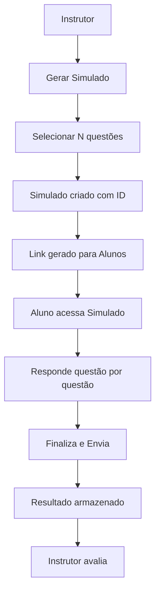

# AMS-QUIZ – Simulado Online sobre as Ilhas Cayman

## 🎯 Objetivo

Desenvolver uma aplicação React moderna chamada **AMS-QUIZ**, que simula um sistema de avaliação online baseado em um curso sobre as Ilhas Cayman. A aplicação terá duas personas: **Instrutor** e **Aluno**, e utilizará **SQLite** como banco de dados.

---

## 🎨 Paleta de Cores (baseada na logomarca)

- **Roxo escuro** (letras "AMS")
- **Bege claro** (texto "CAYMAN")
- **Dourado bronze** (seta sobre o "AMS")
- **Cinza claro** (texto menor)

Estilo visual moderno, elegante, com UX inspirado em **landing pages**.

---

## 🧱 Estrutura do Projeto

```
src/
├── pages/
│   ├── InstructorPage.jsx
│   └── StudentPage.jsx
├── components/
│   ├── QuizForm.jsx
│   ├── QuestionCard.jsx
│   ├── NavigationButtons.jsx
│   └── ResultScreen.jsx
├── services/
│   └── api.js
├── database/
│   └── QuizAppDb.sqlite
├── styles/
│   └── theme.js
└── App.jsx
```

---

## 👨‍🏫 Página do Instrutor

- Lista de simulados gerados por turma
- Botão "Gerar Novo Simulado" com input para número de questões
- Link único gerado para alunos (`/quiz/:simuladoId`)
- Visualização do gabarito correto
- Armazenamento das respostas dos alunos

---

## 🎓 Página do Aluno

- Acesso via link gerado
- Navegação por questões com botões "Voltar" e "Avançar"
- Uma questão por página, com alternativas de **a** a **e**
- Botão "Finalizar" para enviar respostas e ver o resultado
- Respostas são gravadas no SQLite

---

## 🧠 Estrutura das Tabelas SQLite

```sql
CREATE TABLE Questao (
    Id INT PRIMARY KEY IDENTITY,
    Codigo VARCHAR(20),
    Categoria VARCHAR(255),
    Enunciado VARCHAR(MAX),
    ImagemPath VARCHAR(255)
);

DROP TABLE IF EXISTS Alternativa;
GO

CREATE TABLE Alternativa (
    Id INT PRIMARY KEY IDENTITY,
    QuestaoId INT,
    Letra CHAR(1),
    Texto VARCHAR(MAX),
    Correta BIT,
    FOREIGN KEY (QuestaoId) REFERENCES Questao(Id)
);

CREATE TABLE Instrutor (
    Id INTEGER PRIMARY KEY AUTOINCREMENT,
    Nome TEXT,
    Email TEXT
);

CREATE TABLE Aluno (
    Id INTEGER PRIMARY KEY AUTOINCREMENT,
    Nome TEXT,
    Turma TEXT
);
```

---

## 🧩 Modelo PRISMA

```
Instrutor "1" ---< "N" Simulado >--- "N" --- Aluno
                      |
                      V
                 Questao >---< Alternativa
```

- Um **Instrutor** pode gerar vários **Simulados**
- Cada **Simulado** possui várias **Questões**
- Cada **Questão** tem várias **Alternativas**
- **Alunos** respondem os **Simulados**

---

## 📊 Fluxo do Sistema (Mermaid Flowchart)



---

## ✅ Requisitos Técnicos

- React 18+
- SQLite (via API backend Node ou pacote embutido)
- TailwindCSS ou Material UI
- Responsivo para mobile/tablet
- Armazenamento local para progresso

---

## 🔐 Futuras melhorias

- Autenticação por ID
- Exportação em PDF
- Temporizador no simulado
- Relatório estatístico por questão
